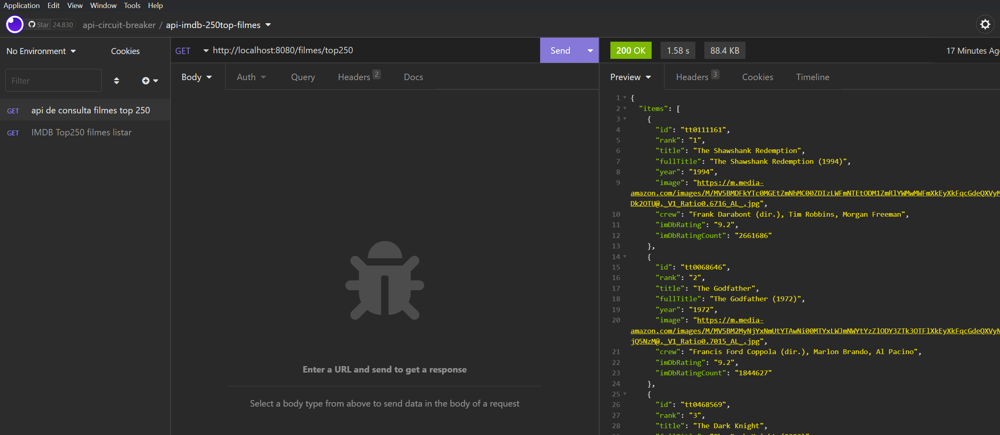
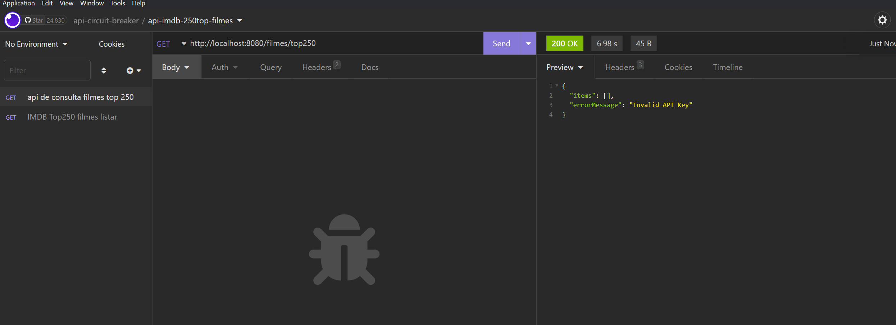
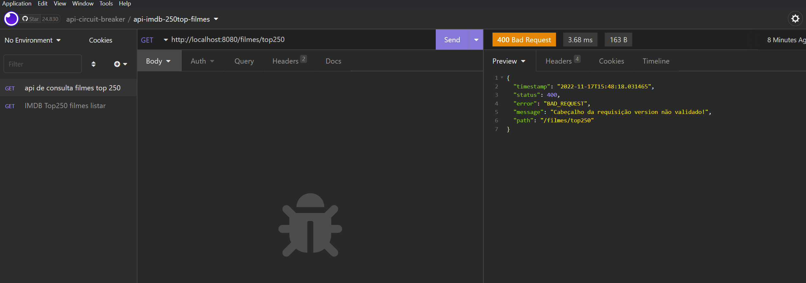

## Desafio 7DaysOfCode

### API do IMDB

* plataforma mais famosa que agrupa basicamente todos os filmes, séries, programas de TV, atores, etc., do mundo. Você pode imaginar que o banco de dados deles deve ser colossal!
* webservice url : https://imdb-api.com/api

## Desafio

* Fazer o seu código Java com Spring rodar e consumir a API do IMDB! Seu objetivo será imprimir os resultados de uma busca na linha de comando.
* Explicando melhor, você vai usar essa API para pesquisar os Top250 filmes e imprimir o JSON correspondente no console da sua IDE.
* Também será preciso gerar uma APIKey (uma chave de acesso), registrando o seu email no site. Com a chave em mãos, você poderá buscar filmes, séries, etc., através da API.
* Ah, e não se esqueça de compartilhar o seu código no seu GitHub e marcar a gente nas suas redes sociais com a hashtag #7DaysOfCode, e também com #feedback7DoC caso você queira alguma ajuda.

## Solução

### Setup do Projeto

* Linguagem de programação: Java
* Tecnologia: Spring Boot 2.6.13
* Gerenciador de dependência: Maven
* Java 17
* IDE IntelJ

### Implementação utilizando as ferramentas do ecossistema Spring com Java 17

* Spring Web: Crie aplicativos da web, incluindo RESTful, usando Spring MVC. Usa Apache Tomcat como o contêiner integrado padrão.
* Bean Validation: é uma especificação que permite validar objetos com facilidade em diferentes camadas da aplicação. A vantagem de usar Bean Validation é que as restrições ficam inseridas nas classes de modelo.
* Spring Cloud OpenFeign: é um cliente de serviço da Web declarativo. Isso facilita a criação de clientes de serviços da Web.
* Swagger

### Documentação da api
* url swagger: http://localhost:8080/swagger-ui.html
* Obrigatorio passar no header Api-Key gerada no site do webservice url : https://imdb-api.com/api
* Obrigatorio passar no header a Accept-Version da API de filme: v1
* url filme: http://localhost:8080/filmes/top250

### Fluxo de sucesso

## Fluxo com mensagem de erro, passando APIKey invalida

## Fluxo com mensagem de erro, passando a Versão da API de filme invalida
